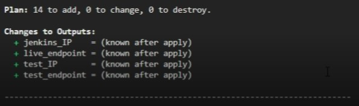
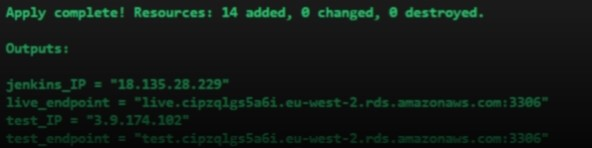
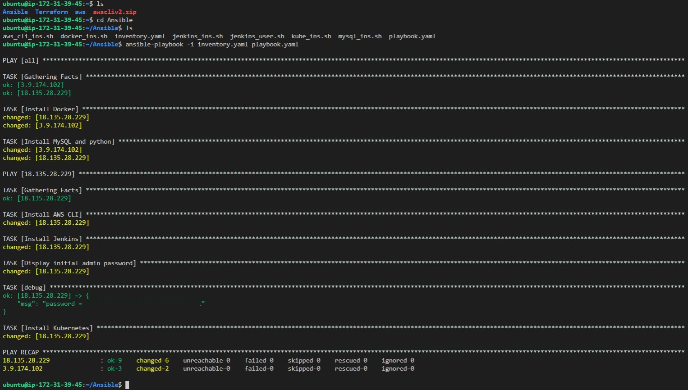

# CI-pipeline
A continuous integration pipeline to successfully deploy [a provided application](https://gitlab.com/qacdevops/cne-sfia2-brief).

## Table of contents

* [Introduction](#Introduction)
* [Planning](#Planning)
* [Setup](#Setup)
* [Deployment](#Deployment)

### **Introduction**
This repository hosts the continuous integration (CI) pipeline that is used in an AWS environment to test and deploy an application. It uses Terraform, Ansible, Jenkins, Docker and Kubernetes to execute the CI pipeline.

### **Planning**
To plan for the project, I used a Kanban board application called Jira which allows its users to effectively create a backlog and a sprint. I split my epics (the main topics) into three sections: Planning, Infrastructure and Pipeline. All the epics combined hosted eleven different issues (the main tasks).

*All the issues and epics:*

*Planning issues:*

*Infrastructure issues:*

*Pipeline issues:*

I also created a diagram to easily visualise how the different components of the pipeline interact with each other.

*Diagram:*

### **Setup**
Using Terraform on a "Setup" EC2, I created the following resources: 
* Two AWS EC2 instances
* Two AWS RDS instances
* Two security groups
* One VPC
* One database subnet group
* Two subnets
* One internet gateway
* One route table
* Two route table association

The code for the Terraform infrastructure can be found under the folder "Terraform". After installing Terraform, you can run it using the following commands:
terraform init
terraform plan
terraform apply

Please note that you will need to add an autovars file that defines the username and password in both the root directory and the RDS subdirectory of the Terraform folder.

*terraform plan results:*

*terraform apply results:*

After the setup has completed, you can generate a key in ~/.ssh using ssh-keygen and add the public key to the authorized_keys file in both EC2 instances created so you can access the EC2 instances from the Setup EC2.

After installing Ansible, we can now use Ansible to configure the EC2 instances by specifying the host and the key location in the inventory.yaml file and running scripts through the Ansible playbook. The Ansible code can be found in the Ansible folder here. 

*Ansible playbook results:*

Please note that the initial Jenkins password will be displayed after "password:" under debug but I have blanked it out for security reasons.

### **Deployment**
Firstly, edit permissions in the sudo visudo file on the Jenkins EC2 to allow the Jenkins user access. Then, add three different environment variables on the EC2: the database URI, test database URI and the secret key (please note, I have made up a sample secret key that I don't use in my Jenkinsfile). You can declare the variables using EXPORT in ~/.bashrc.

I use [my other repository](https://github.com/MP-Prime/CI-Pipeline-Appclone) in conjunction with this one to attempt testing and deployment of the application.
