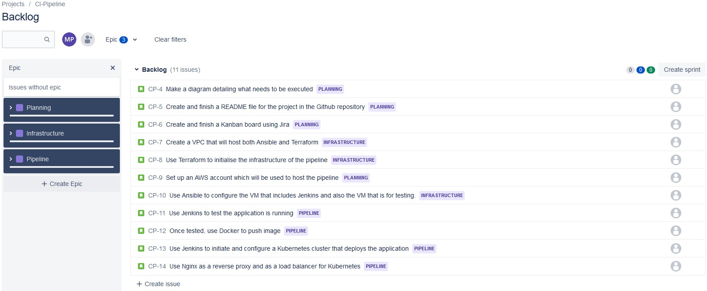
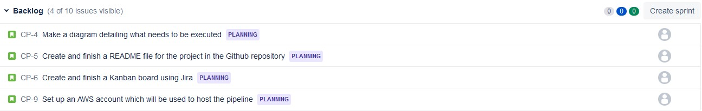
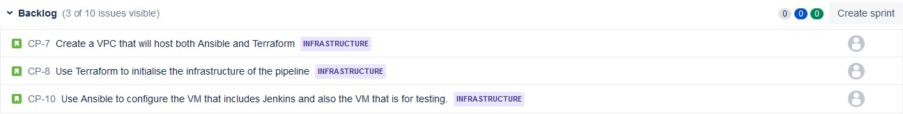
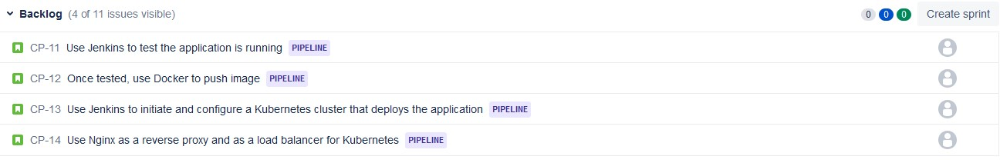
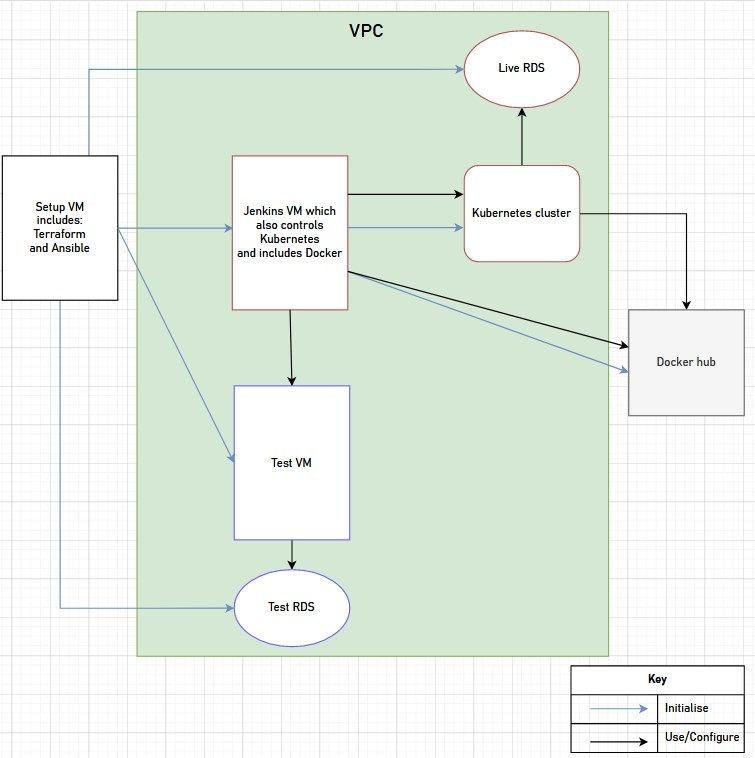

# CI-pipeline
A continuous integration pipeline to successfully deploy [a provided application](https://gitlab.com/qacdevops/cne-sfia2-brief).

## Table of contents

* [Introduction](#Introduction)
* [Planning](#Planning)

### **Introduction**
This repository hosts the continuous integration (CI) pipeline that is used in an AWS environment to test and deploy an application. It uses Terraform, Ansible, Jenkins, Docker and Kubernetes to execute the CI pipeline.

### **Planning**
To plan for the project, I used a Kanban board application called Jira which allows its users to effectively create a backlog and a sprint. I split my epics (the main topics) into three sections: Planning, Infrastructure and Pipeline. All the epics combined hosted eleven different issues (the main tasks).

*All the issues and epics:*

*Planning issues:*

*Infrastructure issues:*

*Pipeline issues:*

I also created a diagram to easily visualise how the different components of the pipeline interact with each other.

*Diagram:*

